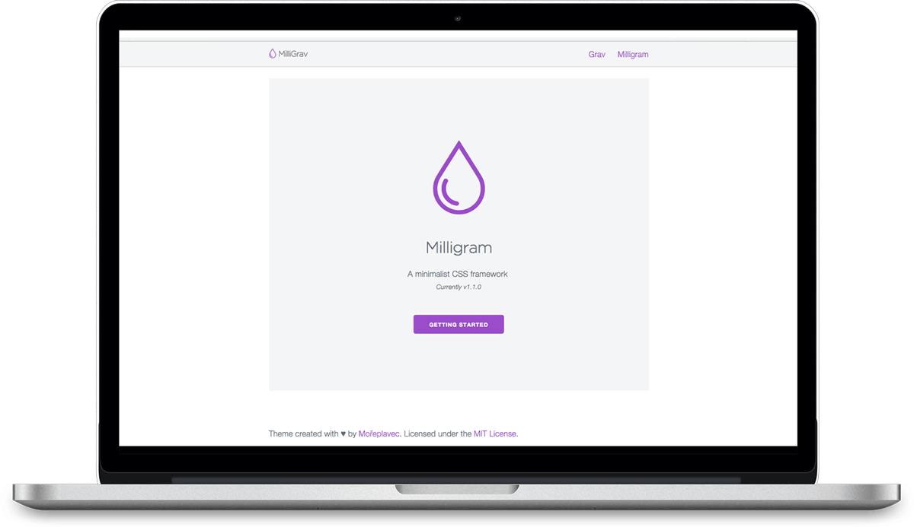

# MilliGrav

MilliGrav is the simple [Grav](http://getgrav.org) theme based on minimalist CSS framework [Milligram](https://milligram.github.io).

# Installation

To install this theme, just download the zip version of this repository and unzip it under `/your/site/grav/user/themes`. Then, rename the folder to `milligrav`. You can find these files on [GitHub](https://github.com/moreplavec/milligrav).

You should now have all the theme files under

    /your/site/grav/user/themes/milligrav

# Updating

Manually updating MilliGrav is pretty simple. Here is what you will need to do to get this done:

* Delete the `your/site/user/themes/milligrav` directory.
* Download the new version of the MilliGrav theme from [GitHub](https://github.com/moreplavec/milligrav).
* Unzip the zip file in `your/site/user/themes` and rename the resulting folder to `milligrav`.
* Clear the Grav cache. The simplest way to do this is by going to the root Grav directory in terminal and typing `bin/grav clear-cache`.

> Note: Any changes you have made to any of the files listed under this directory will also be removed and replaced by the new set. Any files located elsewhere (for example a YAML settings file placed in `user/config/themes`) will remain intact.

# Setup

If you want to set MiniGrav as the default theme, you can do so by following these steps:

* Navigate to `/your/site/grav/user/config`.
* Open the **system.yaml** file.
* Change the `theme:` setting to `theme: milligrav`.
* Save your changes.
* Clear the Grav cache. The simplest way to do this is by going to the root Grav directory in Terminal and typing `bin/grav clear-cache`.

Once this is done, you should be able to see the new theme on the frontend.